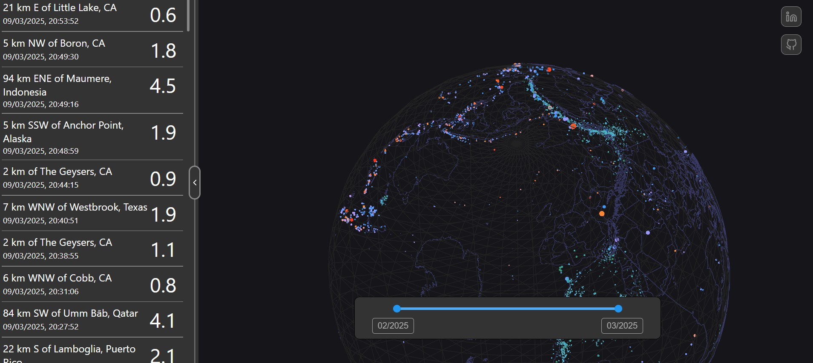

Hi! This is my GitHub!

I am a Software Engineer with a degree in Electrical. Some of my professional interests include: semiconductors, biotechnology, software as a tool for R&D, innovation and entrepreneurship.

You can find me on [LinkedIn](http://linkedin.com/in/blancblanc/)

This GitHub contains (among other things):

## Earthquake Viewer

[Live Demo](https://code-with-blanc.github.io/quake-viewer/)
[Repository](https://github.com/code-with-blanc/quake-viewer)

This is an earthquake viewer with React + Redux for the frontend and three.js for 3D rendering. It is currently just a hobby project that I update occasionally, but with luck, it may become a useful tool for scientific communication. :)

## Pyblocks-sim - Block Diagram Simulator in Python

[Repository](https://github.com/OptMA-VLC/pyblocks)
[User Documentation](https://github.com/OptMA-VLC/pyblocks/tree/main/docs/tutorials) 
[INSCIT conference paper](https://ieeexplore.ieee.org/document/10693408)

A simulator block diagrams in Python, focused on simulations for Visible Light Communication (VLC).
Undergraduate thesis in Electrical Engineering at UFMG.

Features:
    - An input JSON file describes a block diagram (which blocks will be used and their connections)
    - Native support for time series, with the ability to extract data as charts or CSV files
    - Blocks are implemented as Python scripts and discovered at runtime
    - LTSpice integration block for circuit simulation
    - The input file can specify parameters that are provided to the blocks
    - Support for parameter sweep simulations

During program execution, a directory is scanned to find the blocks specified in the input file. The block diagram is modeled as a graph, which is analyzed to determine an execution order according to the dependencies between signal outputs and inputs. The blocks are then executed sequentially and the simulation progress is displayed in real time on a CLI interface.

The CLI layer is completely isolated from the execution engine, adhering to the principle that business logic layers should not depend on I/O layers. Python [introspection tools](https://docs.python.org/3/library/inspect.html) are used to discover files that contain valid block implementations. The fact that it is an interpreted language is used to load and execute user-implemented code at runtime.

## JavaScript Transpilation Inside the Browser

[Repository](https://github.com/code-with-blanc/p5x-playground)

This project was conceived as an online code editor aimed at digital art, and became an exploration of how to transpile JS inside the browser.

Features:
    - VsCode editor
    - Live preview of output with picture-in-picture layout
    - Ability to combine multiple files into a single program
    - Transpilation using rollup.js to allow the user to write code in newer versions of JavaScript / ECMAScript than those supported by the browser

As build tools (e.g., webpack, rollup.js) typically run in a node.js environment with access to the operating system’s file system, it was an interesting challenge to create a virtual representation of the files being edited and configure rollup to work without an actual file system.
